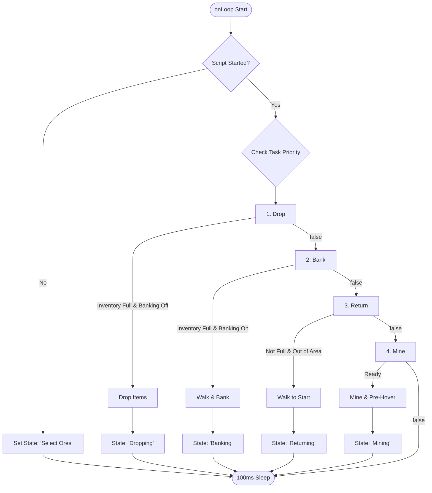

# QMiner

> Legacy Java automation tool for OSBot  
> Used by **17,000+ users** over **9 years**

> [!WARNING]
> **Legacy Archive Notice:** OSBot has transitioned to a non-Java client, meaning Java-based scripts are no longer supported. This project is deprecated and non-functional. It is preserved here as an archived reference for a long-running user-facing Java tool.

An All-in-One (AIO) mining script for OSBot that worked in any location.

Originally released on the [OSBot Forums](https://osbot.org/forum/topic/121108-qminer/), it featured interactive on-screen ore selection, mouse pre-hovering, and options for banking, dropping, and world-hopping.

---

## Why This Project Matters

QMiner was a long-running Java automation tool used by **17,000+ users** over **9 years**.

It demonstrates practical Java engineering under the constraints of an external client API: task-based runtime behavior, interactive HUD controls, decisions based on changing game state, and long-term support for real users.

---

## Screenshots

---

## Features

* **Interactive HUD:** Showed runtime, XP gained, XP/hr, level progress bar, and simple toggle buttons for banking and world-hopping.
* **On-Screen Selection:** Clicked rocks directly in the game window to select or deselect them before starting.
* **Pre-Hovering:** Moved the mouse to the next rock while still mining the current one, improving XP rates and simulating human behavior.
* **Smart Banking:** Found the closest F2P or Members bank, walked there using web-walking, and deposited everything except pickaxes.
* **Power Mining:** Dropped ores instantly when the inventory was full, keeping waterskins, coins, and pickaxes safe.
* **World Hopping:** Automatically hopped worlds if all selected rocks were depleted, with members and F2P world separation.
* **Auto-Return:** If the player got dragged out of the selected mining area, the script automatically walked back to the starting position.

---

## Codebase Structure

Each loop checks the highest-priority behavior first, keeping the runtime logic predictable and easy to reason about.

### Core System

* [Main.java](src/Main.java) - The script entry point. Set up the initial configuration, handled the task list loop, and managed GUI updates.
* [Settings.java](src/Settings.java) - Held configurations like toggles, starting position, selected rocks, and active stats.
* [GUI.java](src/GUI.java) - Managed the custom screen overlay, custom mouse listener for selecting rocks, and HUD toggles.
* [Sleep.java](src/Sleep.java) - Wrapper for OSBot's `ConditionalSleep` to allow waiting for specific conditions.
* [Utility.java](src/Utility.java) - Utility helpers, such as converting milliseconds to a readable time format.

### Tasks (`src/Tasks`)

* [Task.java](src/Tasks/Task.java) - Base abstract class for tasks.
* [Mine.java](src/Tasks/Mine.java) - Mining, pre-hovering next rock, rock validation, depletion checks, camera adjustment, and world-hopping logic.
* [Bank.java](src/Tasks/Bank.java) - Dynamically checked for the nearest bank or deposit box, walked there, and deposited inventory.
* [Drop.java](src/Tasks/Drop.java) - Dropped ores for power-mining while keeping pickaxes and waterskins safe.
* [Return.java](src/Tasks/Return.java) - Safety return walking to the start position if the player drifted away.

---

## State Flow Diagram

---

## Repository Notes

This is a legacy Java project preserved in its original context. The code reflects the constraints, APIs, and practical requirements of the OSBot Java client environment at the time it was actively used.
